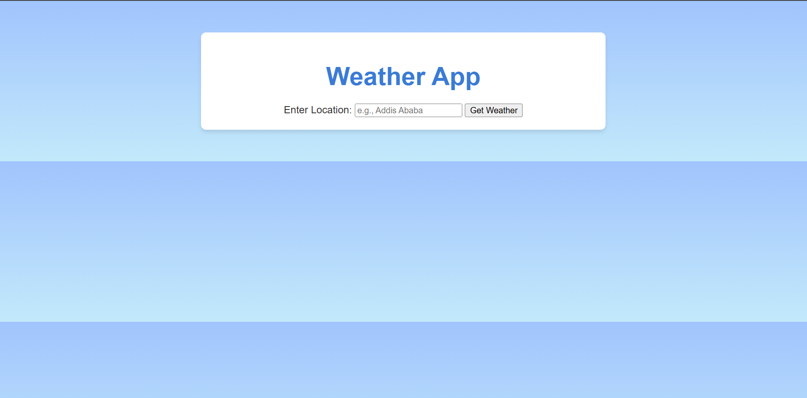
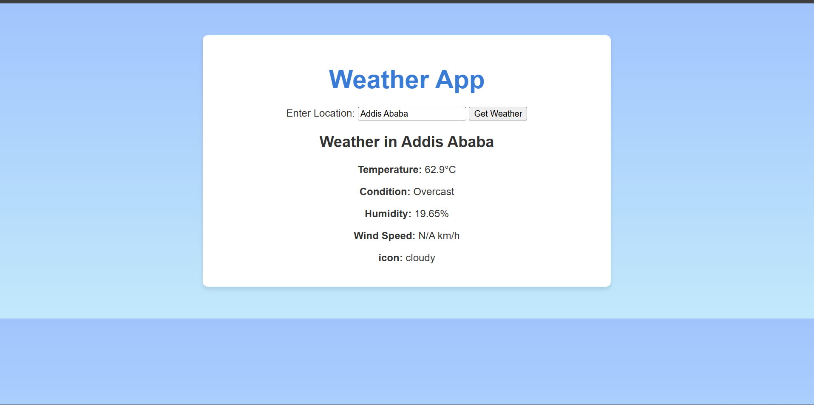

# Weather App 🌦️

A dynamic weather forecast application that allows users to search for weather information by city or location. This project is built using the Visual Crossing Weather API and styled with HTML, CSS, and JavaScript. It was guided by [The Odin Project](https://www.theodinproject.com/) curriculum as part of a learning journey.

## Features

- 🌍 **Search by Location**: Enter any city or location to fetch real-time weather data.
- 🌡️ **Weather Details**: Displays temperature, conditions, humidity, and wind speed.
- ⏳ **Loading Indicator**: Shows a loading message while fetching data from the API.
- 💻 **Responsive Design**: Works across devices, providing a clean and user-friendly interface.
- 🔗 **Powered by API**: Utilizes the [Visual Crossing Weather API](https://www.visualcrossing.com/weather-api) for data.

## Demo

Check out the app in action [here](https://adnan7389.github.io/Weather_App/).

## Screenshots





---

## Technologies Used

- **HTML5**: For structuring the webpage.
- **CSS3**: For styling the app, including responsiveness and aesthetic elements.
- **JavaScript (ES6)**: For dynamic behavior, API integration, and interactivity.
- **Visual Crossing Weather API**: To fetch live weather data.
- **DevTools**: Used for testing and optimizing performance.

---

## Prerequisites

Before running the app, ensure you have:

1. A web browser.
2. A stable internet connection.
3. An API key from [Visual Crossing Weather API](https://www.visualcrossing.com/weather-api).

---

## Installation and Usage

1. **Clone the Repository**:

   ```bash
   git clone https://github.com/your-username/weather-app.git
   cd weather-app
   ```

2. **Get Your API Key**:

   - Sign up for the [Visual Crossing Weather API](https://www.visualcrossing.com/weather-api).
   - Replace the placeholder API key in the `script.js` file with your own:
     ```javascript
     const apiKey = "YOUR_API_KEY";
     ```

3. **Open the App**:

   - Open `index.html` in your browser.
   - Use the search bar to input a location and get the weather details.

4. **Test the Loading Component**:
   - Simulate slow network speeds using browser DevTools to test the loading message.

---

## Code Overview

### Key Files:

- **index.html**: The main structure of the webpage.
- **styles.css**: Contains all styling for the app.
- **script.js**: Handles API calls, form submissions, and DOM updates.

### Core Functions:

1. **`fetchWeatherData(location)`**:
   - Fetches weather data from the API for the given location.
   - Displays a loading message while fetching.
2. **`processWeatherData(data)`**:
   - Extracts and formats the necessary data from the API response.
3. **`displayWeatherData(weatherData)`**:
   - Updates the DOM with weather details for the searched location.

---

## Lessons Learned

This project provided hands-on experience with:

- Fetching and handling API data.
- Manipulating the DOM dynamically with JavaScript.
- Implementing error handling for asynchronous operations.
- Styling a responsive and interactive UI.
- Using DevTools for debugging and performance testing.

---

## Acknowledgments

- This project was inspired and mentored by [The Odin Project](https://www.theodinproject.com/), a comprehensive full-stack web development curriculum.

---

## License

This project is open-source and available under the [MIT License](LICENSE).
